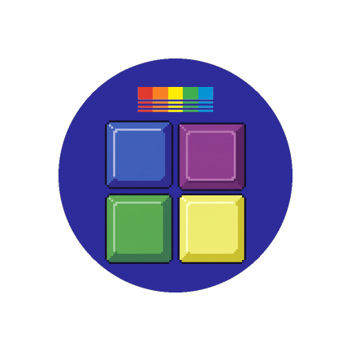

# Tile Launcher

An Android home-screen launcher made of live tiles, in a Commodore 64 look.

The home screen is a scrolling mosaic you arrange yourself. Each tile shows
what it knows (the time, the weather, your next event, how many messages are
waiting) and opens the thing behind it when you tap it. The layout is
Windows-Phone-ish; the *look* is not: light blue on C64 blue, VIC-II colours,
the *Press Start 2P* pixel font, hard edges and bevels instead of shadows and
blur. Tiles are chunky bevelled keys with a faint scanline, a shine and a dithered shade, and they sink when you press them (not when you only scroll past).

<p align="center"></p>

Built with Flutter, for Android only. It works offline (a launcher draws itself
at boot with no network); tiles that need the internet say so and keep their
last answer. It is a personal project and is not on the Play Store.

## What is in it

- **Home:** tiles in 4 or 6 columns, sizes 1×1, 2×2, full-width 4×2 and 4×4, in
  twelve VIC-II colours. Long-press to edit: drag to reorder (an insertion line
  shows where it will land), resize, recolour, delete. Apply or cancel.
- **All Apps:** swipe left. A–Z then Å Ä Ö with a jump index you can scrub,
  or search (best match first); each row shows the app's icon. Long-press an app to pin it, open its details
  or uninstall it. Apps you open often are suggested under **+ ADD TILE**.
- **Tiles:**
  - **Clock**, **Device** (battery and free storage), **Weather** (SMHI, with
    Open-Meteo outside Sweden; coarse location is asked for only when the tile
    is tapped).
  - **Agenda** (read-only calendar: day and week), **Contact** (call, SMS,
    WhatsApp; every action is its own tap), **Mail** (IMAP inbox: open a
    message in full, which marks it read, mark it unread or read again, trash
    with confirmation; app password kept encrypted in the Android Keystore).
  - **Text TV** (a full-screen viewer for texttv.nu), **Calc** (a calculator and
    a unit and currency converter), **Alarm** (timers and alarms handed to the
    phone's clock app), **Sound** and **Flashlight** toggles.
- **Settings:** three themes (C64 screen, pitch-black OLED, beige hardware),
  4 or 6 columns, the gap between tiles, what swiping down at the top and up
  at the bottom of Home does (refresh, notification shade, quick settings,
  All Apps, search), haptics, tile effects and app icons on or off, a themed lock-screen wallpaper you can
  set (or take off again), a shortcut to Android's Home-app chooser, and
  export/import of your layout as text.
- **First run:** the boot screen types out a C64 power-on once.

Nothing acts on its own. Anything that sends, deletes or sets something waits
for an explicit button, and each permission is asked for only when the tile
that needs it is first used.

## Install

There is no store build. Build the APK yourself:

```
flutter pub get
flutter build apk --release        # build/app/outputs/flutter-apk/app-release.apk
```

then install it on the phone (`adb install`, or copy the file across). To use
it as your launcher, choose **Tile Launcher** as the default Home app (Android
settings → Apps → Default apps → Home app; there is also a shortcut under
SETTINGS → CHOOSE HOME APP). Know how to get back to your usual launcher first.

The release build is currently signed with the debug key (see the `release`
block in `android/app/build.gradle.kts`). That is fine for side-loading on your
own phone and not for publishing; add your own signing configuration first if
that ever changes.

### Permissions

| Permission | Used for | Asked |
|---|---|---|
| `INTERNET` | weather, Text TV, exchange rates, mail | at install |
| `ACCESS_COARSE_LOCATION` | the weather tile's place (never precise) | when the tile is tapped |
| `READ_CALENDAR` | the agenda tile | when the tile is tapped |
| `READ_CONTACTS` | contact tiles and the picker | when you add a contact |
| `CALL_PHONE`, `SEND_SMS` | the CALL and SMS buttons on a contact | on the first use of each |
| `SET_ALARM` | timers and alarms in the clock app | at install |
| `EXPAND_STATUS_BAR` | the swipe gestures for the shade | at install |
| `SET_WALLPAPER` | the WALLPAPER setting, only when you confirm it | at install |
| `REQUEST_DELETE_PACKAGES` | the drawer's uninstall action | at install |
| `ACCESS_NOTIFICATION_POLICY` | the Sound tile | granted in Android's settings |

Backup is switched off: the mail password is encrypted with a key that lives only
in this phone, so a restored copy could never be read.

## Development

The repo root is the Flutter project. Run everything from here:

```
flutter pub get
flutter run                                        # device or emulator
dart format --output=none --set-exit-if-changed .
flutter analyze
flutter test
flutter build apk --debug                          # after touching android/
```

The app icon is generated, not hand-edited: `python tool/make_app_icon.py`
(needs Pillow) rebuilds every density, the adaptive and monochrome layers and
the legacy icons from the pictures in `design/icon/`.

### Layout

- `lib/model/`: pure-Dart core: tiles, sizes, grid packing, settings, parsers
- `lib/services/`: service interfaces (apps, storage, weather, mail, …) and their Android or network implementations
- `lib/ui/`: the theme (VIC-II palettes, grid metrics) and the widgets that render state
- `android/`: manifest (Home intent filter, package-visibility queries) and the Kotlin channel handlers
- `test/`: mirrors `lib/`; `test/fakes/` holds the fakes
- `tool/`: scripts (the icon generator)
- `design/`: reference material and the icon's source pictures, not code ([design/README.md](design/README.md)): `reference/` is the look and feel, `mockups/` is structural inspiration only, `icon/` feeds the icon generator

### Contributing / agents

See [AGENTS.md](AGENTS.md) and [.agents/](.agents/README.md) for architecture,
conventions and the definition of done, and [plan.md](plan.md) for the phases,
what is done and what is next.

## Credits

- Font: [Press Start 2P](https://fonts.google.com/specimen/Press+Start+2P) by
  CodeMan38, SIL Open Font License 1.1 (`fonts/OFL.txt`).
- Data: [SMHI](https://opendata.smhi.se/) and
  [Open-Meteo](https://open-meteo.com/) (weather),
  [texttv.nu](https://texttv.nu/) (Text TV), the European Central Bank's daily
  reference rates (currency conversion).
- Commodore 64 and VIC-II are the inspiration for the look; this project has no
  connection with Commodore or its successors.

## Licence

[MIT](LICENSE) © 2026 Kay Wiberg. The bundled font keeps its own licence.
